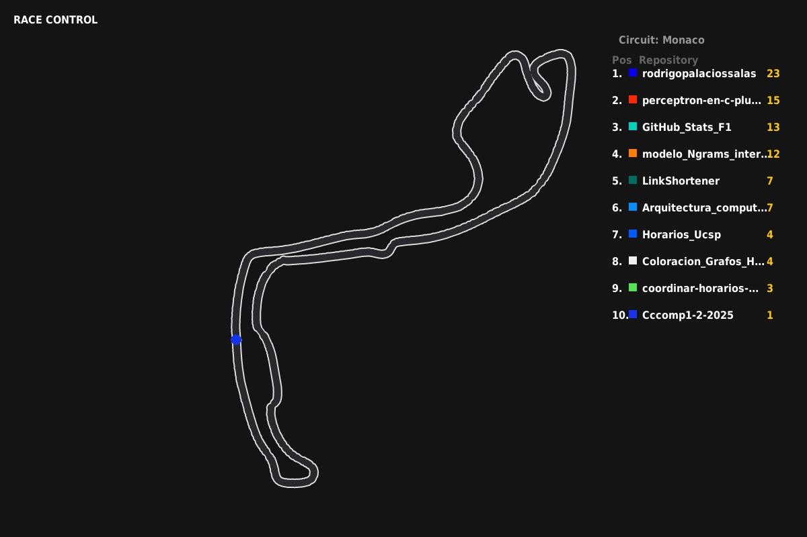

# 🏎️ GitHub Stats F1 Racer

**¡Transforma la actividad de tus repositorios de GitHub en una emocionante carrera de Fórmula 1!**

Este proyecto de Python visualiza tus repositorios como monoplazas de F1 que compiten en un circuito basándose en su actividad (commits). Incluye gráficos de alta calidad, físicas simuladas y eventos dinámicos.



## ✨ Características Principales

*   **🏁 Carreras en Tiempo Real**: Los coches avanzan basándose en los datos reales de commits extraídos de la API de GitHub.
*   **🎨 Visuales Premium (SSAA)**: Motor de renderizado con SuperSampling Anti-Aliasing (4x) para bordes suaves y gráficos nítidos en 4K reescalados.
*   **🔥 Sistema de Partículas**: Efectos visuales avanzados como humo y fuego cuando los coches sufren "fallos de motor" o se retiran.
*   **📊 Leaderboard Dinámico**: Tabla de clasificación en vivo que detecta adelantamientos y reagrupa las posiciones suavemente.
*   **🏎️ Modo Simulación**: Un modo de prueba (`test_race.py`) para experimentar con las físicas y causar caos manual sin necesidad de conexión a internet.

## 🛠️ Requisitos e Instalación

Asegúrate de tener **Python 3.8+** instalado.

### 1. Clonar el repositorio
```bash
git clone https://github.com/tu-usuario/GitHub_Stats_F1.git
cd GitHub_Stats_F1
```

### 2. Crear entorno virtual (Recomendado)
```bash
python -m venv .venv
# En Windows:
.venv\Scripts\activate
# En Mac/Linux:
source .venv/bin/activate
```

### 3. Instalar dependencias
El proyecto utiliza `pygame` para los gráficos y `PyGithub` para la API.
```bash
pip install -r requirements.txt
```

## ⚙️ Configuración

Para visualizar tus propios repositorios, necesitas configurar tus credenciales de GitHub.

1.  Crea un archivo `.env` en la raíz del proyecto (puedes usar `.env.example` como base).
2.  Agrega tu token y usuario:
    ```ini
    GITHUB_TOKEN=tu_token_personal_de_github
    GITHUB_USERNAME=tu_nombre_de_usuario
    ```
    > 💡 **Nota**: Puedes obtener un token en [GitHub Settings > Developer settings > Personal access tokens](https://github.com/settings/tokens).

## 🚀 Uso

### Modo en Vivo (Datos Reales)
Visualiza tus repositorios actuales compitiendo:
```bash
python main.py
```
*   Carga tus repositorios más activos.
*   Genera un circuito aleatorio.
*   La velocidad de cada coche depende del número total de commits.

### Modo de Prueba (Simulación)
Prueba los gráficos y controles manuales con datos falsos:
```bash
python test_race.py
```
**Controles en Modo Prueba:**
*   `ESPACIO`: **Evento de Caos** (Reordenamiento aleatorio de posiciones).
*   `ENTER`: **Fallo de Motor** (Provoca humo/fuego en el último coche y lo retira temporalmente).

## 📂 Estructura del Proyecto

*   `main.py`: Punto de entrada principal para la aplicación conectada a la API.
*   `test_race.py`: Script de prueba para desarrollo y debug visual.
*   `config.py`: Configuraciones globales (Resolución, FPS, Año, Circuito predeterminado).
*   `src/`:
    *   `visualizer.py`: Motor gráfico (Pygame, renderizado, UI).
    *   `car.py`: Lógica de los vehículos y físicas.
    *   `race_engine.py`: Generación de circuitos y cálculos de carrera.
    *   `data_manager.py`: Conexión con la API de GitHub.

---
Hecho con 🐍 Python y 🏎️ Pasión por la F1.
